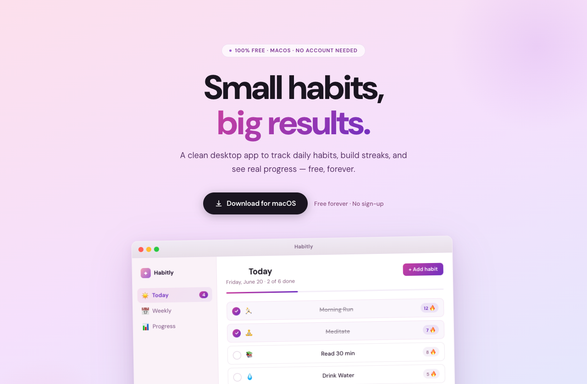

# Habitly 🗒️

A clean, free, no-account habit tracker for macOS — plus the marketing
landing page that ships with it.



## What's in here

This repo holds two separate things:

- **`src/`** — the Electron desktop app (Today / Weekly / Progress views, a
  habit modal, local persistence).
- **`web/`** — a zero-build static landing page (`web/index.html`) used to
  market and distribute the app.

## Features

- Add, edit, and delete habits with an icon and a custom repeat schedule.
- **Today** — check off habits, see today's streaks and completion ring.
- **Weekly** — a 7-day grid of done/missed/pending per habit.
- **Progress** — best streak, this week's completion rate, and a **Month**
  tab that graphs your real day-by-day completion history.
- **Settings** — light/dark/system theme, 5 accent colors, week-start day,
  show/hide streaks & completion %, a daily reminder, and a full data reset.
- Data persists locally (`electron-store`) — nothing leaves your machine,
  no account, no network calls. See [`SECURITY.md`](./SECURITY.md).

## Tech stack

- Electron Forge + Vite + TypeScript
- React 19 (renderer UI)
- Electron-store for local persistence
- Plain HTML/CSS for the landing page

## Project structure

```
src/
  lib/
    store/                  # electron-store setup (main) + contextBridge API (preload)
    data/seed.ts             # demo habit data
    constants/accent-colors.ts  # accent color presets used by Settings
    types.ts                 # shared types (Habit, HistoryEntry, AppSettings, PersistedState)
  components/      # title-bar, sidebar, habit-modal, circular-progress
  views/           # today-view, weekly-view, progress-view, settings-view
  App.tsx, main.ts, preload.ts, renderer.tsx, global.d.ts, index.css
web/
  index.html, styles.css, assets/   # landing page + favicon/OG images
build/
  icon.icns, icon.iconset/          # macOS app icon
design/                             # original design mockups (reference only)
```

## Getting started

```bash
yarn install
yarn start      # launch the desktop app in dev mode
```

### Building the macOS app

```bash
yarn make       # produces a .dmg and .zip in out/make
```

### Running the landing page

`web/` has no build step — just open it directly:

```bash
open web/index.html
# or, to serve it over http://localhost instead of file://
npx serve web
```

## Other scripts

```bash
yarn lint              # eslint
npx tsc --noEmit       # type-check
```

## Deploying the landing page

`web/` deploys to Vercel as-is: import the repo, set **Root Directory** to
`web`, no build command needed. Update the `og:image`/`twitter:image` tags
in `web/index.html` with the deployed absolute URL once it's live, and swap
the "Download for macOS" links from `#` to the real `.dmg` (e.g. a GitHub
Release asset).

Once the repo is imported via Vercel's GitHub integration, every push to
`main` auto-deploys — no GitHub Actions workflow needed. To skip rebuilding
when only `src/` (the desktop app) changes, set an **Ignored Build Step** in
Vercel → Project Settings → Git:

```bash
git diff --quiet HEAD^ HEAD -- web
```

(exit code 0 = no `web/` changes = skip the build; non-zero = deploy.)

## Versioning & changelog

This project follows [Semantic Versioning](https://semver.org/), tracked in
`package.json`'s `version` field, with history kept in
[`CHANGELOG.md`](./CHANGELOG.md) using the
[Keep a Changelog](https://keepachangelog.com/en/1.1.0/) format.

To cut a release:

1. Move the relevant `[Unreleased]` entries under a new `## [x.y.z] - YYYY-MM-DD`
   heading in `CHANGELOG.md`.
2. Bump `version` in `package.json` to match.
3. `yarn make` to build, tag the commit (`git tag vX.Y.Z`), and publish a
   GitHub Release with the built `.dmg`/`.zip` attached.

The desktop app's Settings → About screen always shows the real running
version (read live via Electron's `app.getVersion()`), so it can't drift
out of sync with `package.json`.

## License

MIT
